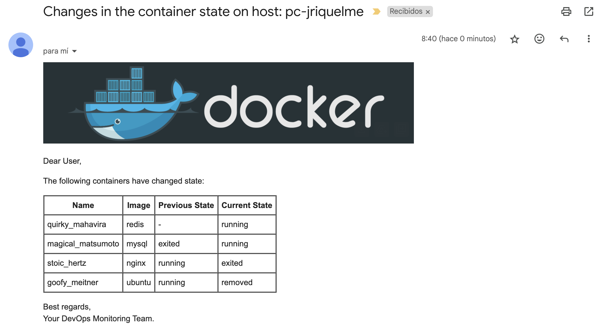

# Docker Container State Monitor

## Overview

This repository contains a Node.js application designed to monitor the state of Docker containers and send email notifications about any changes. It checks for container state changes and sends detailed email notifications with a table of changes. The tool is particularly useful for keeping track of container states and being promptly informed of any changes.
## Email Notification Example



## Prerequisites

Ensure you have the following before you begin:
- Node.js (version 18 or higher)
- Docker (if you plan to use the Docker image)
- An email server with SMTP access

## Environment Variables

Create a `.env` file in the root of your project and add the following environment variables:

```env
EMAIL_HOST=your-email-host
EMAIL_PORT=your-email-port
EMAIL_USER=your-email-user
EMAIL_PASS=your-email-pass
EMAIL_RECIPIENT=your-email-recipient
HOSTNAME=your-hostname
```

- `EMAIL_HOST`: The SMTP server to use for sending emails.
- `EMAIL_PORT`: The port to use for the SMTP server.
- `EMAIL_USER`: The username for the SMTP server.
- `EMAIL_PASS`: The password for the SMTP server.
- `EMAIL_RECIPIENT`: The email address to send notifications to.
- `HOSTNAME`: The name of the host where the Docker containers are running.

## How to Use

### Running Locally

1. Clone the repository:
   ```sh
   git clone https://github.com/peperiquelmee/docker-monitor.git
   cd docker-monitor
   ```

2. Install dependencies:
   ```sh
   npm install
   ```

3. Create a `.env` file in the root directory and add your environment variables as described above.

4. Run the application:
   ```sh
   npm start
   ```

### Running with Docker

1. Build the Docker image:
   ```sh
   docker build -t docker-monitor .
   ```

2. Run the Docker container:
   ```sh
   docker run -d \
     -e EMAIL_HOST=your-email-host \
     -e EMAIL_PORT=your-email-port \
     -e EMAIL_USER=your-email-user \
     -e EMAIL_PASS=your-email-pass \
     -e EMAIL_RECIPIENT=your-email-recipient \
     -e HOSTNAME=your-hostname \
     -v /var/run/docker.sock:/var/run/docker.sock \
     docker-monitor
   ```

## Docker Hub

You can find the Docker image on Docker Hub:
[https://hub.docker.com/repository/docker/peperiquelmee/docker-monitor/general](https://hub.docker.com/repository/docker/peperiquelmee/docker-monitor/general)

## Additional Information

This project has been tested on macOS and Linux, on both AMD and ARM architectures. It has not been tested on Windows, but it is not excluded from working on that platform.